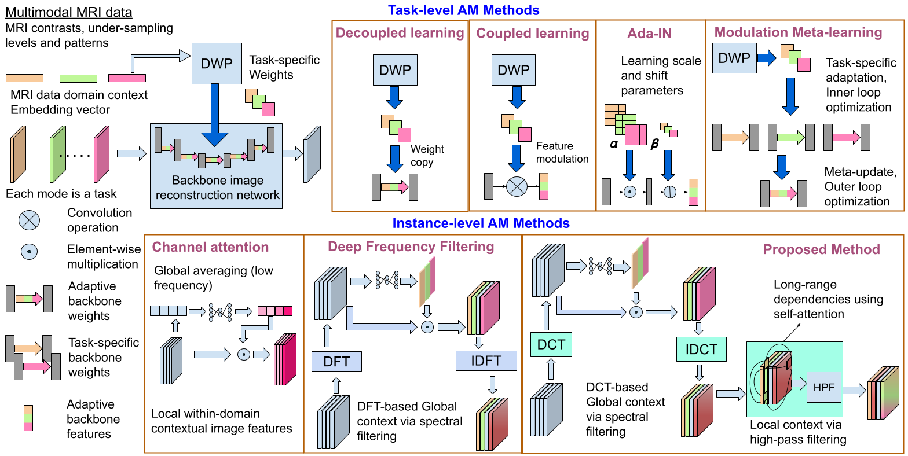

# Dynamic Spectral filtering and high-pass filtering for  MRI reconstruction
### *An Instance-specific Spectral attention mechanism and dynamic high-pass kernel generation for  MRI Reconstruction* 
> [SHFormer: A Dynamic Spectral Filtering Convolution Neural Network and High-pass Kernel Generation Transformer for Adaptive MRI Reconstruction]()  


Concept diagram comparing previous neuromodulation-based attention mechanisms (AMs) with the proposed method for heterogeneous MRI data. Methods like decoupled learning, coupled learning, and modulation meta-learning use a dynamic weight prediction (DWP) network with the backbone image reconstruction network. These methods extract task-specific features, wherein each mode of the multimodal MRI data is posed as a task. Methods like adaptive instance normalization, channel attention, and spectral filtering  operate at the instance level, focusing on either local contextual information within images or global mode-specific information. All these methods incline toward low-frequency components of the image data. The proposed AM captures both global task-level and instance-level features with a focus on high-frequency components of the data.
## Dependencies
#### Packages
* *PyTorch*
* *TensorboardX*
* *numpy*
* *tqdm*
 
An exhaustive list of packages used could be found in the *requirements.txt* file. Install the same using the following command:

```bash
 conda create --name <env> --file requirements.txt
```

## Folder hierarchies 

Folder hierarchy to set up datasets (input, label pairs)
--------------------------------------------------------

Each Acquisition context has three settings - DATASET_TYPE, MASK_TYPE and acceleration factor represented in short ACC_FACTOR

DATASET_TYPE indicates the different types of anatomy images that we would like to combine in a single training
MASK type indicates the kind of mask pattern which we use in the training. 
ACC_FACTOR - the acceleration factor for reconstruction 

<base_path>/datasets/DATASET_TYPE/MASK_TYPE/ACC_FACTOR/<train_support, train_query, validation_support and validation_query folders>


The folder hierarchy for the under-sampling masks are stored in a folder seperately as follows.
<base_path>/us_masks/DATASET_TYPE/MASK_TYPE/mask_<ACC_FACTOR>.npy

For example, to stored the 4x mask for Gaussian mask type for MRBrains FLAIR is stored as follows.

<base_path>/us_masks/mrbrain_t1/gaussian/mask_4x.npy

Note that if the mask is made on the fly for a given mask type and acceleration factor, then accordingly the changes needs to be done in dataset.py to generate random mask and based on that generate the under-sampled images. In that case, mask need not be stored.


Folder hierarchy for experiments folder
----------------------------------------

The hierarchy is similar to the one for datasets but in the experiments/<model_name>/results folder

<base_path>/experiments/<model_name>/results/DATASET_TYPE/MASK_TYPE/ACC_FACTOR

<model_name> - this is the folder with the model name in which the model files are stored.
results - this is the folder in which all the predicted test files are stored in .h5 format for each acquisition context.

## Train code 

```bash
sh train_combinedall.sh
```

## Test code 

```bash
sh valid_combinedall.sh
```

## Evaluate PSNR / SSIM metrics 

```bash
sh evaluate_combinedall.sh
```

## Display PSNR / SSIM metrics 

```bash
sh report_collect_combinedall.sh
```

